# ОТЧЁТ ПО ПРАКТИЧЕСКОЙ РАБОТЕ №1
## Тема: Конечные автоматы

    Преподаватель:                  А.С. Кузнецов
    Студент: КИ-24-17/1Б, 032427400 А.И. Дворянцев

### Цель работы
Реализация и исследование детерминированных и недетерминированных конечных автоматов.

### Задачи
1. Ознакомиться со сведениями по теории конечных автоматов.
2. Используя изученные механизмы, разработать в системе JFLAP согласно постановке задачи детерминированный конечный автомат, а также произвести программную реализацию на языке программирования Java. В случае невозможности создания ДКА, это должно доказываться формально.
3. Используя изученные механизмы, разработать в системе JFLAP недетерминированный конечный автомат, а также произвести программную реализацию на языке программирования Java. В случае невозможности создания НКА, это должно доказываться формально.

### Вариант задания

Вариант 4

а) Построить ДКА, допускающий в алфавите {a, b} все строки, где
остаток от деления на три количества символов a больше 1.

б) Построить НКА с количеством состояний, не превышающим 5, для языка
{abab^n : n ≥ 0} U {aba^n : n ≥ 0}.

### Граф переходов ДКА
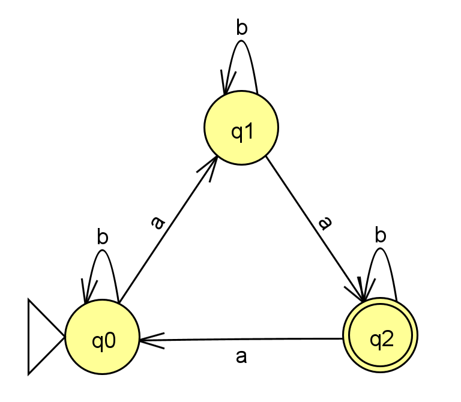

### Граф переходов НКА
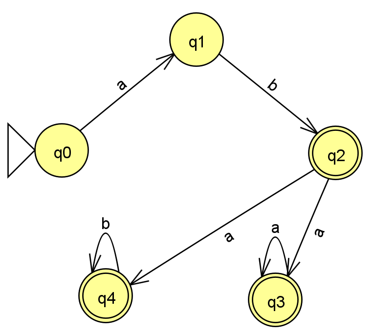

Тестовые цепочки для ДКА и НКА находятся в файлах DFA_test.txt и NFA_test.txt соответственно.

### Пошаговое выполнение процесса распознавания нескольких тестовых цепочек ДКА

#### Цепочка: aab
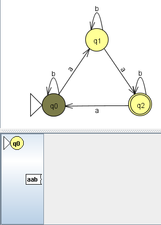

*Старт*

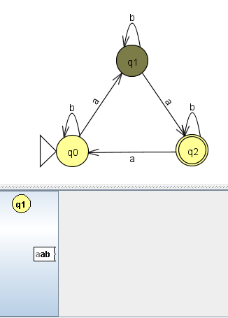

*Шаг 1*

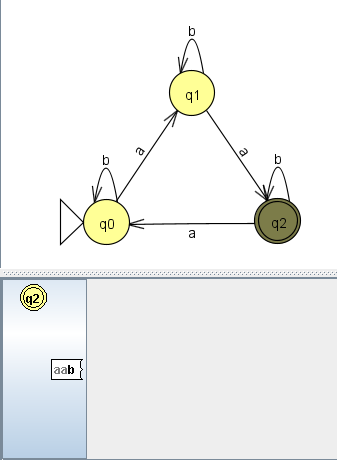

*Шаг 2*

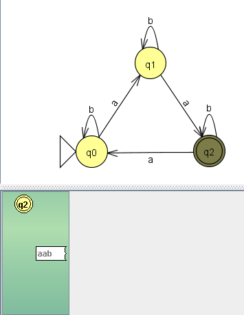

*Шаг 3 - принято*

#### Цепочка: abab
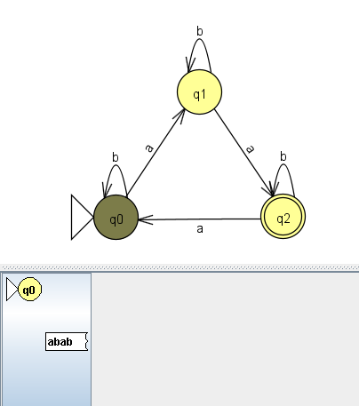

*Старт*


*Шаг 1*

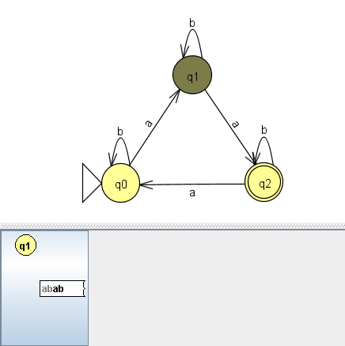

*Шаг 2*

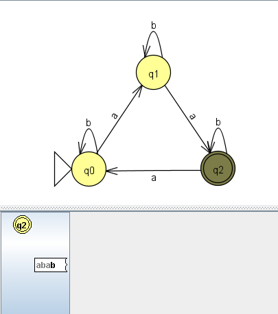

*Шаг 3*

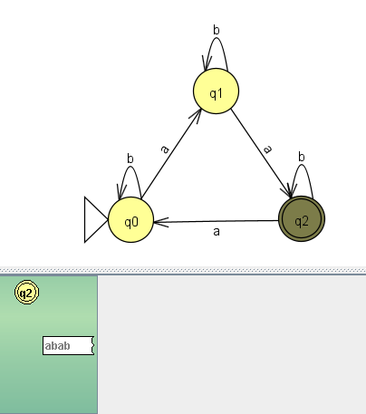

*Шаг 4 - принято*

#### Цепочка: bbb
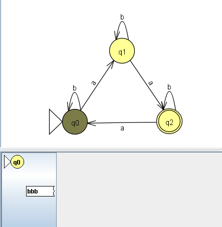

*Старт*

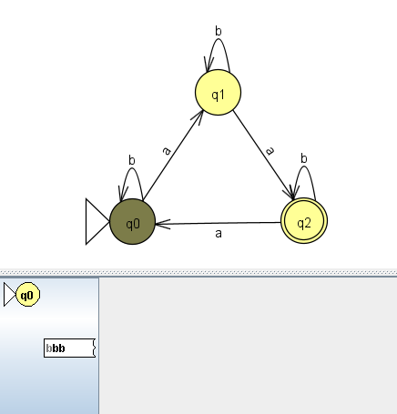

*Шаг 1*


*Шаг 2*

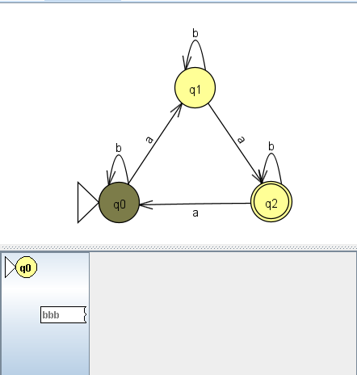

*Шаг 3*

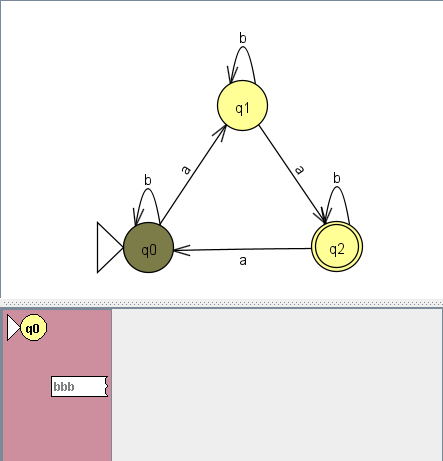

*Шаг 4 - отвергнуто*

### Пошаговое выполнение процесса распознавания нескольких тестовых цепочек НКА

#### Цепочка: aba
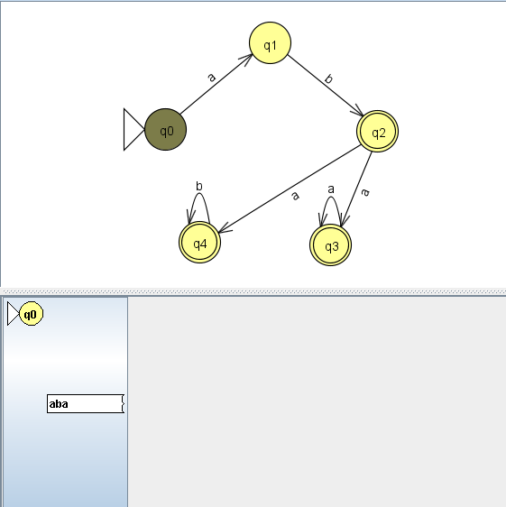

*Старт*

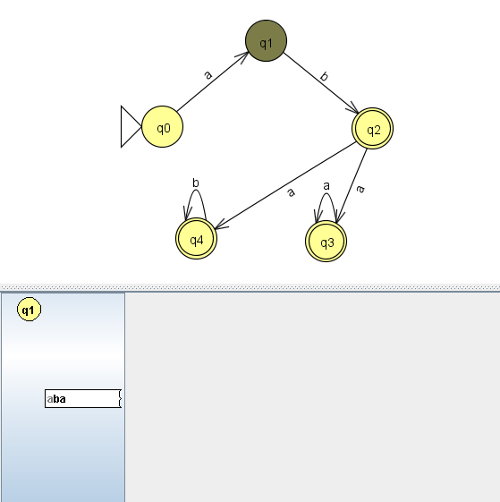

*Шаг 1*

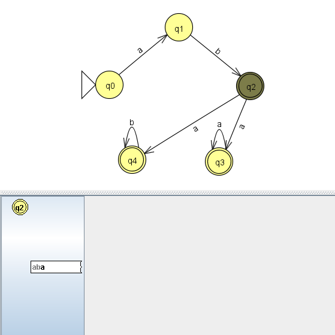

*Шаг 2*

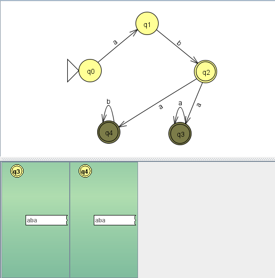

*Шаг 3 - принято*

#### Цепочка: abab
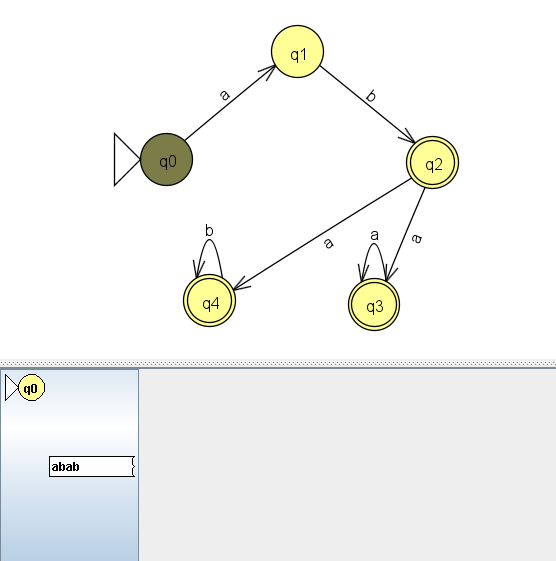

*Старт*

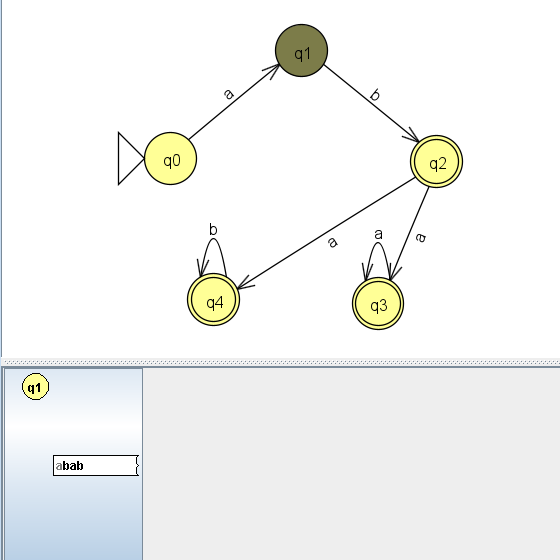

*Шаг 1*

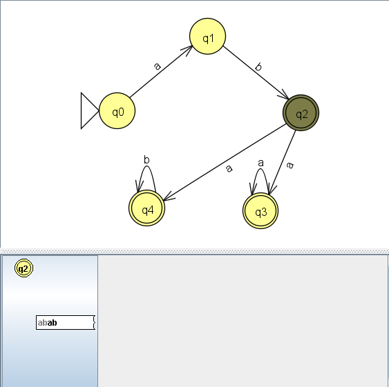

*Шаг 2*

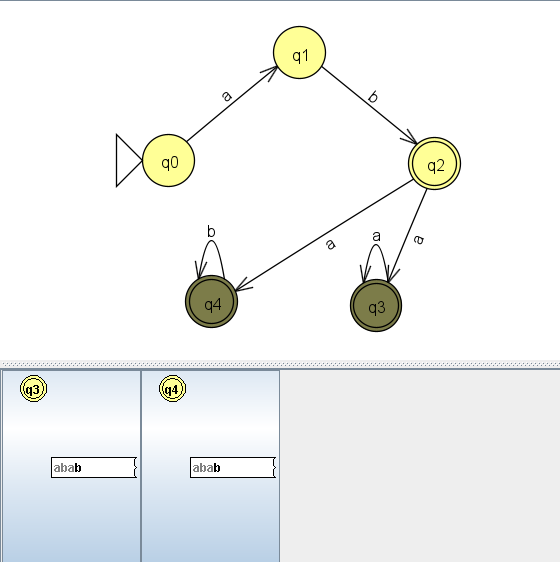

*Шаг 3*

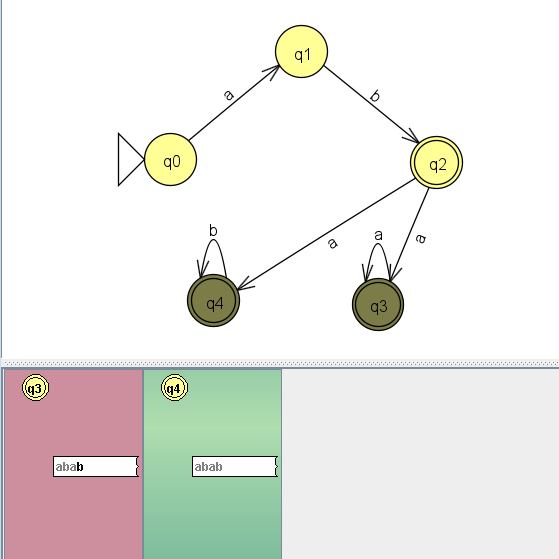

*Шаг 4 - принято*

#### Цепочка: abb


*Старт*

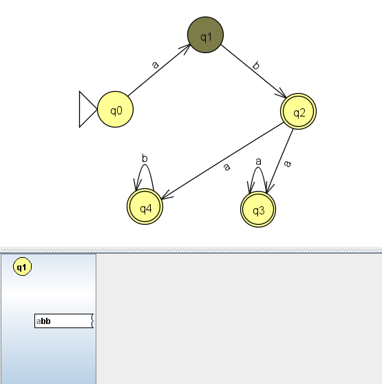

*Шаг 1*

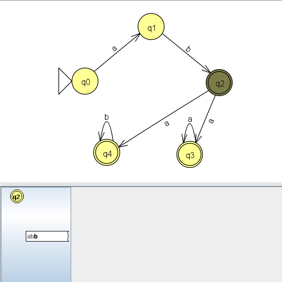

*Шаг 2*

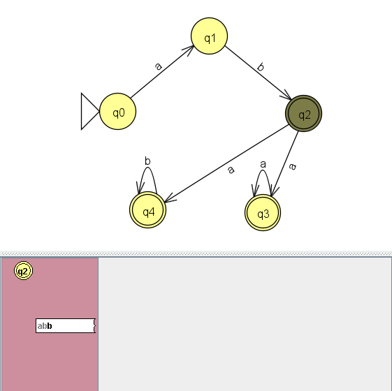

*Шаг 3 - отвергнуто*

### Сборка и запуск программы
Требования: JDK 8+

#### Сборка
В консоли в директории с файлом FiniteAutomaton.java:
```bash
  javac -encoding UTF-8 FiniteAutomaton.java
```

#### Запуск
Для корректного отображения символа 'ε' может потребоваться сменить кодировку консоли:
```bash
  chcp 65001
```
Запуск:
```bash
  java FiniteAutomaton
```
